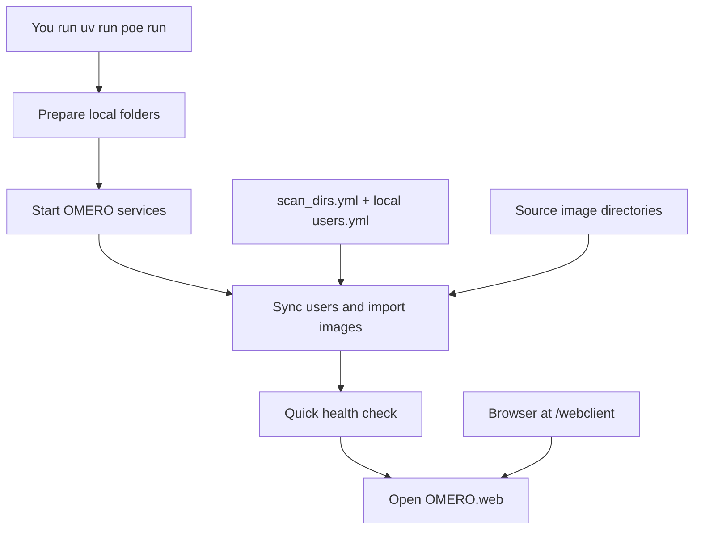

# habomero

Reproducible OMERO local-server deployment for development and pre-production testing.

## What this repo provides

- Docker Compose stack for `postgres`, `omero-server`, and `omero-web`
- Ansible-based local provisioning of runtime directories
- `uv` + `poe` operational commands
- Backup/restore and validation scripts
- Pre-commit linting for Python, YAML, Docker, shell, and Ansible

## High-level flow



## Quick start (macOS and Linux)

1. Install prerequisites:
   - Docker (Docker Desktop on macOS)
   - `uv`
1. Install project dependencies:

```bash
uv sync --group dev
```

3. Create local configuration files from templates:

```bash
cp .env.example .env
cp config/omero/users.example.yml config/omero/users.yml
```

4. Set local secrets and user access:

```bash
vim .env
vim config/omero/users.yml
```

`config/omero/users.yml` is ignored by Git. Keep real OMERO user passwords in
`.env` and reference them from `users.yml` with `password_env`.

5. Configure and mount scan directories:

```bash
vim config/omero/scan_dirs.yml
uv run poe scan-dirs
```

Every path in `scan_directories` must exist locally before `scan-dirs` or
startup tasks run. For SMB shares, mount them at the local paths configured in
`config/omero/scan_dirs.yml`.

6. Prepare local directories:

```bash
uv run poe provision
```

7. Start stack:

```bash
uv run poe up
```

`poe up` prints both localhost and local-network URLs for copy/paste sharing.

8. Sync the configured OMERO users and groups:

```bash
uv run poe sync-users
```

9. Validate and inspect:

```bash
uv run poe validate
uv run poe healthcheck
uv run poe logs
```

OMERO.web is exposed at `http://localhost:${OMERO_WEB_PORT:-4080}`.
For a Linux server on a local network, see [LAN hostname setup](#lan-hostname-setup)
to make the service reachable as `habomero.local` or `habomero`.

All `poe` operations are restricted to project-root execution and fail if run from another directory.

## LAN hostname setup

The repo can print a hostname URL via `OMERO_PUBLIC_HOSTNAME`, but the hostname
itself has to be provided by the Linux host or your network.

For mDNS on a Linux server, which gives most macOS/Linux clients
`http://habomero.local:${OMERO_WEB_PORT:-4080}/webclient/`:

```bash
sudo hostnamectl set-hostname habomero
sudo apt-get update
sudo apt-get install -y avahi-daemon
sudo systemctl enable --now avahi-daemon
```

Allow OMERO.web and mDNS through the host firewall if one is enabled:

```bash
sudo ufw allow 4080/tcp
sudo ufw allow 5353/udp
```

Then set this in the server's local `.env`:

```bash
OMERO_PUBLIC_HOSTNAME=habomero.local
```

For the shorter `http://habomero:${OMERO_WEB_PORT:-4080}/webclient/`, configure
your router/DHCP DNS to resolve `habomero` to the server's LAN IP, or add a
hosts-file entry on each client:

```text
192.168.1.50 habomero
```

After DNS or mDNS is configured, run:

```bash
uv run poe show-url
```

## Operations

- One-command local run:

```bash
uv run poe run
```

`poe run` now also auto-imports new `.tif`/`.tiff` files from the mounted
scan directory (`OMERO_SCAN_DIR` -> `/scan/inbox`) using the first user in
`config/omero/users.yml`.
Imports mirror directory hierarchy in OMERO Folders (folders map to folders,
images map to images). If `shared_group` is set in `config/omero/scan_dirs.yml`,
configured users are joined to that group by default and imported content is
visible to all group members. Set `join_shared_group: false` on restricted
users that should not see shared content. Set `import_mode: inplace` in
`config/omero/scan_dirs.yml` to avoid duplicate storage by importing file
references instead of copying pixel data.
`config/omero/users.yml` is local-only and ignored by Git; commit changes to
`config/omero/users.example.yml` instead, and use `password_env` entries with
real password values in `.env`.
Scan roots may also be configured as mappings with `path` and `group`; imports
for that root run in the configured OMERO group instead of the global shared
group. Set `delete_omero_missing_files: true` to delete tracked OMERO Images
when their source files are no longer present after a successful source-root
scan. This only deletes OMERO records, not source files.

- Production-style full-dataset parallel ingest with periodic rescan:

```bash
uv run poe remote-run-parallel-full
```

`remote-run-parallel-full` performs startup (`scan-dirs`, `up`, `sync-users`,
`healthcheck`) and then starts continuous full-dataset safe import in parallel
mode. It keeps rescanning and importing indefinitely. Default pause between
cycles is 300 seconds and is controlled by `safe_import_cycle_pause_seconds` in
`config/omero/scan_dirs.yml`.

- Sync allowlisted OMERO users:

```bash
uv run poe sync-users
```

- Backup database:

```bash
uv run poe backup
```

- Safe recovery restart without deleting existing OMERO data:

```bash
uv run poe safe-restart
uv run poe healthcheck
```

- Restore database from dump:

```bash
uv run poe restore -- data/backups/<dump-file>.sql
```

## Spin down instructions

Orderly spin-down (keeps data volumes):

```bash
uv run poe down
```

Full teardown (removes containers, networks, and project volumes):

```bash
docker compose down --volumes --remove-orphans
```

Optional cleanup of runtime data directories (destructive):

```bash
rm -rf data/postgres data/omero data/omero-web-var
```

## Linting and tests

- Run all pre-commit hooks:

```bash
uv run pre-commit run --all-files
```

- Run tests:

```bash
uv run pytest
```

## Documentation

- [Architecture](docs/src/architecture.md)
- [Operations](docs/src/operations.md)
- [Recovery](docs/src/recovery.md)
